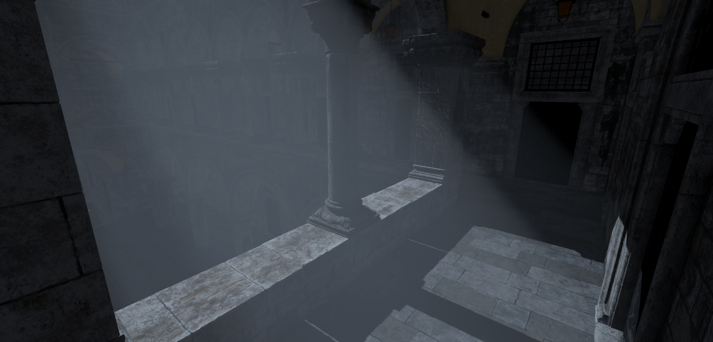

# Unity_Volumetric_Rendering

Volumetric lighting / clouds and physically based atmosphere scattering implemented in Unity

---

### Volumetric lighting

Support for main directional light in Universal Render Pipeline.  Use physically based model to simulate light absorption, out-scattering, emission and in-scattering. Use depth-aware upsampling to speed up raymarching.

---

### Volumetric cloud

